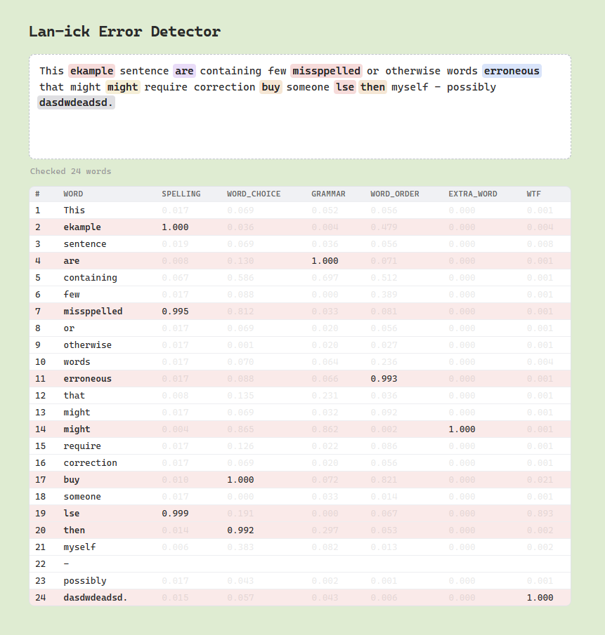

# lan-ick

Using LLM interpretability through middle-layer sparse auto-encoders to detect spelling, grammar, and word-level errors from internal model activations.

lan-ick is a small research project built around a simple question: if a pre-trained large language model already internally represents states like "this token looks wrong", can this signal be exposed with sparse auto-encoders and turned into a usable detector? The current system runs Gemma 3 1B, reads hidden states from a handful of middle layers, encodes them with GemmaScope 2 SAEs, and trains lightweight one-vs-rest classifiers over the resulting sparse features.

The result is a detector that can flag six categories of issues at the word level:

- `spelling`
- `word_choice`
- `grammar`
- `word_order`
- `extra_word`
- `wtf` (gibberish / obviously broken token sequences)

This project is about detection, not correction. It is also very much a fun side project: the results are interesting and sometimes surprisingly strong, but the system is still too slow and too brittle to meaningfully replace or threaten mature hand-crafted spell checkers.



^ Current browser UI with inline highlights and per-word per-type scores.

## What This Project Does

At a high level, lan-ick research pipeline starts from clean English sentences, injects them with synthetic errors, extracts SAE activations from Gemma 3, and learns which sparse internal features correlate with specific error types. At inference time, it runs the same stack on arbitrary user text and produces per-word probabilities plus thresholded error labels.

Important constraints:

- The system is intentionally built on a pre-trained model, not an instruction-tuned spelling assistant.
- The pipeline is reusable and not tied to the experiment harness.
- The emphasis is on low false positives, because underlining correct text is worse than missing some errors.
- The current benchmark is synthetic, so strong numbers here do not automatically imply real-world production readiness.

## How It Works

```text
Example token flow                                              Step meaning
------------------                                              ------------

sentence:                "Some    short        senttence"       clean sentence
                           ↓        ↓           ↓
tokenization:            (Some) ( short) ( sent)(ten)(ce)       sentence split into tokens
                           ↓        ↓       ↓     ↓    ↓
embeddings:                e1       e2      e3    e4   e5       e_x = dense vector for each token with 1152 features
                           ↓        ↓       ↓     ↓    ↓
LLM hidden layers:     ╭⟶ h1       h2      h3    h4   h5       h_x = dense vector with 1152 features, updated across 26 layers
                       │   ↓¯¯¯¯¯¯↘¯↓¯¯¯¯¯↘¯↓¯¯¯↘¯↓¯↘ ↓
                       ╰── h1'      h2'     h3'   h4'  h5'
                           ⇓        ⇓       ⇓     ⇓    ⇓
layer selection:           h1"      h2"     h3"   h4"  h5"      collect all activations of 4 out of 26 layers: 3, 7, 13, 25
                           ↓        ↓                  ↓
last-token pick:           h1"      h2"                h5"      pick activations of last token of each word
                           ↓        ↓                  ↓
SAE encoding:              z1       z2                 z5       z_x = sparse vector with 16,384 features
                           ↓        ↓                  ↓
word score:                s1       s2                 s5       OVR logistic regression over sparse features
                           ↓        ↓                  ↓
UI output:               (clean) (clean)            (error)     threshold and label error
                           ↓        ↓                  ↓
final attribution:       "Some    short        senttence"
                         clean    clean          error
```

When training on clean / errored sentence pairs, the positive signal is intentionally narrow. The system does **not** treat the whole corrupted sentence as positive evidence. Instead:

- only labeled error words contribute positive positions
- only their **last token positions** are counted
- any feature that also fires anywhere in the clean sibling text is removed from the positive candidate pool
- all last-token positions from the clean sentence are later used as negative examples during classifier training

That pairwise clean-vs-error subtraction is a big part of why the detector stays reasonably precise. In effect, the clean sentence acts as a per-example baseline, and only the extra activation mass tied to the labeled error word is allowed to become positive evidence.

### Why Some Errors Are Fundamentally Hard

Some of the system's limitations are not just data problems or threshold problems. They come directly from the mechanics of autoregressive language models.

- **Causal masking limits what a token can know.** Earlier subword tokens in a word cannot see later characters, and the current word cannot see future words. If an error only becomes obvious from right-context that has not been generated yet, the representation at the scored token may simply not contain the needed evidence.
- **Gemma's tokenization makes word boundaries awkward.** The leading space is attached to the *next* token, so the current token does not receive a clean "the word ended here" marker. At the last token of a word the model has seen the word so far, but it still does not know word completion as decisively as a word-level system would.
- **Last-token-only helps, but it does not fully solve the problem.** Restricting training and inference to last-token positions was a clear win, because that is the point with the most complete local evidence. But longer words are still harder: if the corruption happens early in a multi-token word, the signal often weakens by the time it reaches the final token.
- **This is why surface errors beat contextual errors.** Misspellings, extra-word artifacts, and obvious gibberish create strong local anomalies. Grammar and word-choice errors often depend on broader context, so they are structurally disadvantaged in this setup.

There are two slightly different operating modes:

- Offline experiments optimize for combined precision / combined recall / `F0.5` on held-out synthetic data.
- The live UI uses a slightly more permissive threshold cap because it feels better in practice and catches more obvious mistakes.

## Models, Features, and Data

### Models

- Base model: `google/gemma-3-1b-pt`
- SAE release: `gemma-scope-2-1b-pt-res-all`
- SAE width: `16k`
- Active layers: `[3, 7, 13, 25]`
- Classifier: one-vs-rest logistic regression over selected SAE features

The implementation uses HuggingFace `transformers` plus SAELens. It does not use TransformerLens.

### Data source

- Clean source text comes from the `stanfordnlp/sst2` training split.
- The project builds clean / errored sentence pairs by injecting exactly one error family per sentence.
- The current default scale is `6000` pairs total, roughly `1000` per error type.

### Synthetic corruption at a high level

The corruption code applies transformations such as:

- character swaps, insertions, deletions, dropped doubles, vowel substitutions, repeated letters
- homophone / confusable replacements such as `their -> there` or `buy -> by`
- grammar swaps and local structural disturbances
- word order swaps
- extra word insertion
- deliberate gibberish generation

The data is handled pairwise: every errored sentence stays attached to its clean counterpart, which makes it possible to compare activations at corresponding positions instead of treating the task as plain text classification.

## Current Snapshot

The main evaluation is on held-out synthetic data. Two numbers matter in practice:

| Setting | F0.5 | Combined precision | Combined recall | Notes |
| --- | --- | --- | --- | --- |
| Best precision-oriented offline setting (`cap=1.00`) | `87.4% +/- 0.8%` | `88.1%` | `84.6%` | Best aggregate metric |
| Current UI / production setting (`cap=0.95`) | `83.0% +/- 0.3%` | `81.1%` | `91.5%` | Chosen because it catches more obvious live errors |

The current UI setting is intentionally not the best `F0.5` configuration. It trades about 5 points of precision for about 7 points of recall, which makes the live demo noticeably better at catching duplicate-letter spelling errors and other obvious mistakes.

## The Secret Sauce

The project works best when several ideas are combined, not when any one component is used in isolation.

- **Middle-layer sparse features**: the signal is strongest in a small set of middle layers, not at the very top.
- **Last-token-only word scoring**: scoring the last token of a word worked much better than using every token in the word.
- **Pairwise clean-vs-error filtering**: features are selected from labeled error-word positions and filtered against activations from the clean partner, which removes a lot of generic token noise.
- **Position-aware feature selection**: selecting features specifically at labeled error-word positions reduces a lot of noise.
- **Simple classifiers with careful calibration**: logistic regression plus threshold calibration beat fancier classifier ideas.
- **Caching**: expensive feature extraction is cached, and the trained classifier is cached separately so the UI can restart without retraining.

## Unexpectedly Strong Findings

- Sparse SAE activations really do carry useful error-detection signal, even in a small pre-trained model.
- Early and middle layers mattered more than expected. The current `[3, 7, 13, 25]` stack beat a deeper-layer baseline.
- `16k` SAEs were already good enough. Wider SAEs were not worth the extra cost.
- Threshold calibration mattered more than many of the more elaborate modeling ideas.
- Surface-form corruption types such as `spelling`, `extra_word`, and `wtf` are much easier than subtle contextual problems.

## Weak Points and Failed Experiments

The project log is fairly honest about what did **not** work.

- Grammar and word-choice errors remain the weakest part of the system because many of them are contextual rather than surface-level.
- The autoregressive masking and tokenization scheme mean some word-level errors are fundamentally hard to attribute cleanly at the token where we want to score them.
- The benchmark is synthetic. Real user writing is messier and distribution-shifted.
- The pipeline is slow because it still runs the base LLM plus multiple SAEs at inference time.
- Random forests underperformed logistic regression.
- Wider SAEs (`65k`, `262k`) did not justify their speed / memory cost.
- Diversifying grammar corruption to be more realistic actually hurt detection badly (which means detection outside of synthetic benchmarks is likely very weak).
- Negative-feature selection and reducing feature counts for noisy categories did not produce meaningful wins.

In other words: the project found a real signal, but not a production-grade spell checker.

## Running It

The repo uses `uv` and Python 3.12+.

Install dependencies:

```bash
uv sync
```

Run the current experiment entry point:

```bash
uv run python3 -m experiments.run
```

Run the browser UI:

```bash
uv run python3 -m ui.server
```

Then open:

```text
http://localhost:8811
```

Notes:

- First run will download Gemma 3 and the SAE weights.
- The experiment pipeline can take a long time because feature extraction is expensive.
- A CUDA GPU is strongly recommended. The current setup was designed around roughly an 8 GB VRAM budget.
- All generated artifacts live under `temp/` and are disposable.

## Experiment Workflow and Living Docs

The repo is organized more like an experiment notebook than a polished library release.

- [experiments/log.md](experiments/log.md): append-only lab notebook with experiment goals, hypotheses, metrics, analysis, conclusions, and commit hashes.
- [experiments/ideas.md](experiments/ideas.md): prioritized backlog of follow-ups, plus a record of ideas that were completed or ruled out.

If you want to understand how the project evolved, start with those two files.

## Repository Layout

```text
src/
  model.py        # Gemma + SAE loading and activation extraction
  data.py         # synthetic pair generation
  classifier.py   # feature selection, OVR training, calibration
  pipeline.py     # cached training + inference pipeline

experiments/
  run.py          # current experiment entry point
  log.md          # append-only experiment log
  ideas.md        # future ideas and completed directions

ui/
  server.py       # minimal HTTP server
  static/         # browser UI

resources/
  example.png     # UI screenshot used in this README

temp/
  data/           # cached synthetic pairs and extracted features
  results/        # experiment outputs
  models/         # downloaded model / SAE artifacts
```

## What This Is Not

lan-ick is not trying to beat LanguageTool, Word, Hunspell, or other mature spell checkers on speed, polish, or reliability. It is a research toy with sharp edges whose main value is the interpretability angle:

- Can SAE features expose error-like internal states in a pre-trained LLM?
- Which error types are already separable in hidden activations?
- Which ones fail because the representation is too surface-driven or too noisy?

That makes it a fun project. It does not make it a replacement for production spelling or grammar tools.

## If You Want To Dig In

Good places to start:

- Read [experiments/log.md](experiments/log.md) from the latest experiments backward.
- Open [src/pipeline.py](src/pipeline.py) for the end-to-end training and inference path.
- Open [src/model.py](src/model.py) to see how Gemma hidden states are turned into SAE features.
- Run the UI and try obviously broken text, duplicate-letter spelling errors, and confusable word swaps.
